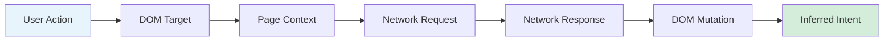
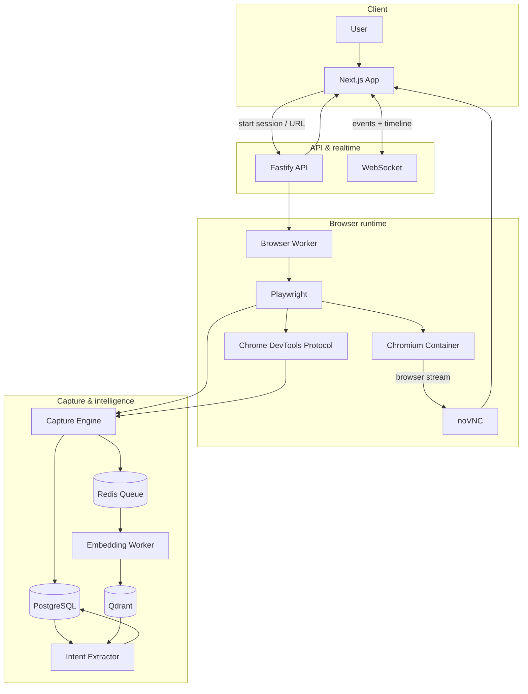
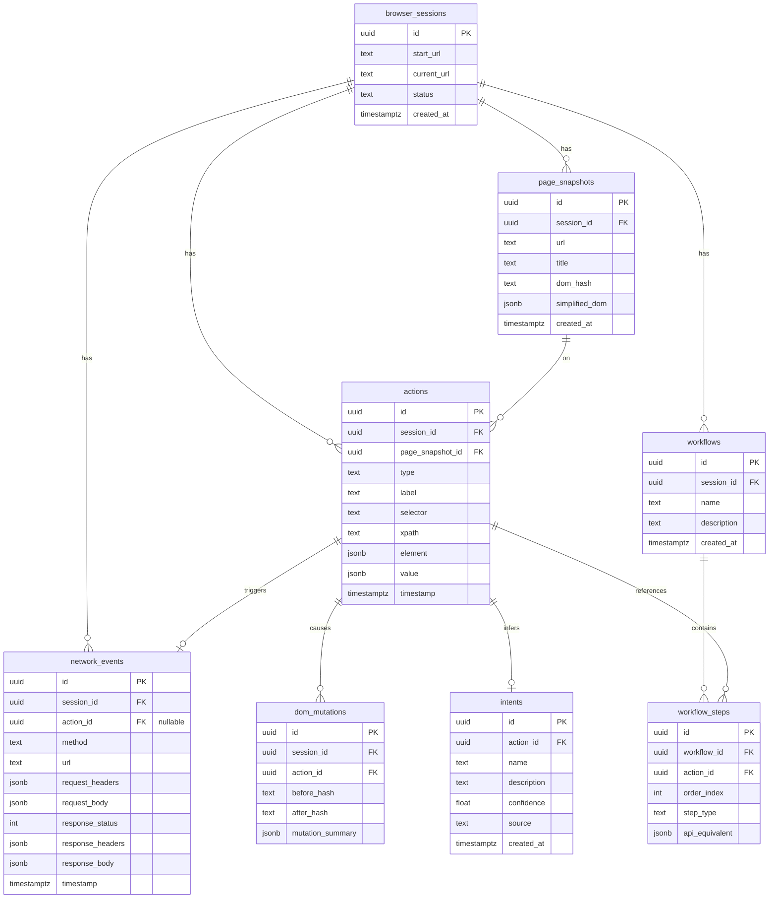
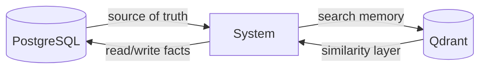
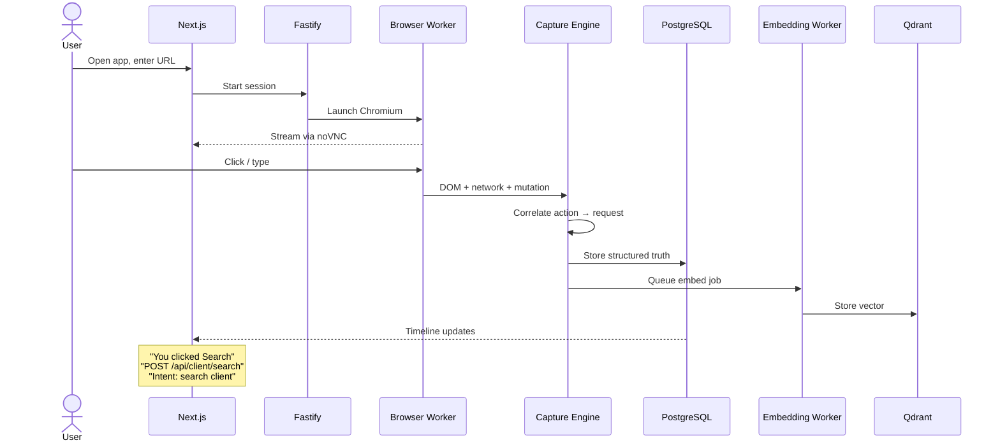
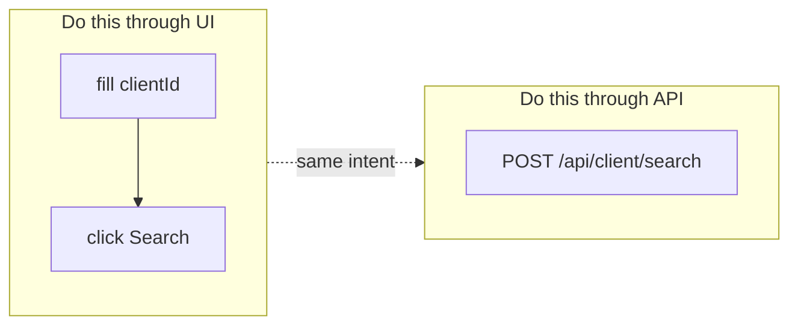
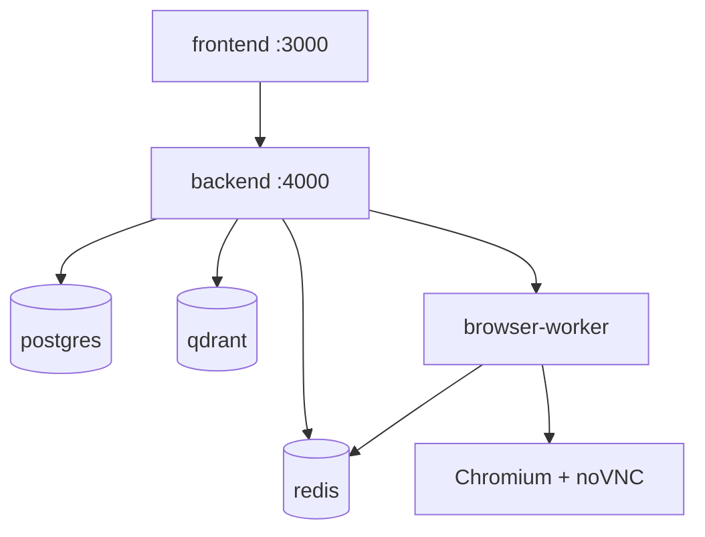

# V1 Proposal: Interaction-to-API Memory Layer

## Core idea

V1 should prove one thing:

> **A human uses a website once, and the system learns the DOM action + network call relationship well enough to replay it or suggest the direct API operation.**


| Not this         | This                           |
| ---------------- | ------------------------------ |
| AI browser agent | Browser interaction recorder   |
| Full automation  | System-intent extractor        |
| Visual AI        | Structured action → API memory |


---

## 1. V1 stack spec


| Layer               | Choices                                                                                                   |
| ------------------- | --------------------------------------------------------------------------------------------------------- |
| **Frontend**        | Next.js, React, TypeScript                                                                                |
| **Browser view**    | noVNC (first)                                                                                             |
| **Realtime**        | WebSocket                                                                                                 |
| **UI**              | URL input, remote browser, recording controls, event timeline, network inspector, extracted workflow view |
| **Backend API**     | Node.js + Fastify                                                                                         |
| **Browser control** | Playwright on Chromium                                                                                    |
| **Instrumentation** | Chrome DevTools Protocol (CDP)                                                                            |
| **Workers**         | BullMQ                                                                                                    |
| **Primary DB**      | PostgreSQL                                                                                                |
| **Vector DB**       | Qdrant                                                                                                    |
| **Queue / cache**   | Redis                                                                                                     |
| **File storage**    | Local Docker volume (optional exports only)                                                               |
| **Embeddings**      | Local sentence-transformers or Ollama                                                                     |
| **LLM**             | Optional local Ollama                                                                                     |
| **V1 intelligence** | Rule-based + embedding search first                                                                       |
| **Infra**           | Docker Compose: `frontend`, `backend`, `browser-worker`, `postgres`, `qdrant`, `redis`                    |


---

## 2. What V1 should capture

When the user performs an action (e.g. click **Search**), capture this chain:




**Example stored event:**

```json
{
  "action": {
    "type": "click",
    "label": "Search",
    "selector": "button[data-testid='search-client']",
    "xpath": "/html/body/main/form/button",
    "text": "Search"
  },
  "network": {
    "method": "POST",
    "url": "/api/client/search",
    "request_body": { "clientId": "12345" },
    "response_body": {
      "clientName": "John Smith",
      "status": "active"
    }
  },
  "intent": {
    "name": "search_client",
    "confidence": 0.86
  }
}
```

---

## 3. What V1 should NOT do

Keep the first version sharp. **Avoid in V1:**

- Full visual agent
- Screenshot / video-first memory
- Multi-user enterprise permission model
- Cloud object storage
- Complex workflow builder
- Autonomous agent execution
- Browser extension
- Mobile support
- Canvas / WebGL understanding
- Anti-bot bypassing

---

## 4. V1 architecture




**Data roles:** PostgreSQL = source of truth · Qdrant = similarity search · Redis = queue + cache

---

## 5. Main services

### frontend


| Responsibility            |
| ------------------------- |
| Simple local auth (login) |
| URL input                 |
| Embedded remote browser   |
| Recording start / stop    |
| Action timeline           |
| Network request viewer    |
| Inferred workflow viewer  |


### backend-api


| Responsibility                           |
| ---------------------------------------- |
| Create browser sessions                  |
| Start / stop recording                   |
| Expose captured actions & network events |
| Expose extracted workflows               |
| Replay simple actions                    |


Use **Fastify** — simple and fast.

### browser-worker

**Heart of the product.**


| Responsibility                       |
| ------------------------------------ |
| Launch Chromium                      |
| Control Playwright page              |
| Attach CDP session                   |
| Capture DOM target on click / input  |
| Capture request / response           |
| Correlate user action → network call |


### capture-engine

Lives inside `browser-worker` in V1.


| Responsibility                      |
| ----------------------------------- |
| Assign action IDs                   |
| Timestamp everything                |
| Correlate events within time window |
| Calculate before / after DOM diff   |
| Write to Postgres                   |


**Correlation rule (example):**

```text
Network request fired within 0–1500ms after click
  AND request initiator came from same frame
  AND DOM changed after response
  ⇒ likely caused by that click
```

### embedding-worker


| Responsibility                |
| ----------------------------- |
| Turn action records into text |
| Create embedding              |
| Store vector in Qdrant        |


**Example embedding text:**

```text
User clicked Search button on Client page.
Button text: Search.
Request: POST /api/client/search.
Payload fields: clientId.
Response fields: clientName, status.
Likely intent: search client by client ID.
```

---

## 6. Database design

### PostgreSQL tables




| Table              | Key fields                                                                                                                |
| ------------------ | ------------------------------------------------------------------------------------------------------------------------- |
| `browser_sessions` | `id`, `start_url`, `current_url`, `status`, `created_at`                                                                  |
| `page_snapshots`   | `id`, `session_id`, `url`, `title`, `dom_hash`, `simplified_dom_jsonb`, `created_at`                                      |
| `actions`          | `id`, `session_id`, `page_snapshot_id`, `type`, `label`, `selector`, `xpath`, `element_jsonb`, `value_jsonb`, `timestamp` |
| `network_events`   | `id`, `session_id`, `action_id` (nullable), `method`, `url`, request/response JSONB, `timestamp`                          |
| `dom_mutations`    | `id`, `session_id`, `action_id`, `before_hash`, `after_hash`, `mutation_summary_jsonb`                                    |
| `intents`          | `id`, `action_id`, `name`, `description`, `confidence`, `source`, `created_at`                                            |
| `workflows`        | `id`, `session_id`, `name`, `description`, `created_at`                                                                   |
| `workflow_steps`   | `id`, `workflow_id`, `action_id`, `order_index`, `step_type`, `api_equivalent_jsonb`                                      |


---

## 7. Qdrant collections


| Collection           | Role                                     |
| -------------------- | ---------------------------------------- |
| `interaction_memory` | Similarity search over past interactions |


**Vector:** size depends on embedding model

**Payload:** `action_id`, `session_id`, `url`, `action_type`, `label`, `request_method`, `request_url`, `inferred_intent`




---

## 8. Event flow




| Step | What happens                                                                       |
| ---- | ---------------------------------------------------------------------------------- |
| 1    | User opens app                                                                     |
| 2    | User enters target URL                                                             |
| 3    | Backend launches Chromium session                                                  |
| 4    | Frontend displays remote browser (noVNC)                                           |
| 5    | User clicks / types normally                                                       |
| 6    | Playwright + CDP capture element, input, DOM metadata, request, response, mutation |
| 7    | Capture engine correlates action → network                                         |
| 8    | Postgres stores structured truth                                                   |
| 9    | Worker embeds the interaction                                                      |
| 10   | Qdrant stores searchable memory                                                    |
| 11   | UI shows correlated timeline                                                       |


---

## 9. V1 screens

**Minimum screens:**


| #   | Screen                   | Purpose                                 |
| --- | ------------------------ | --------------------------------------- |
| 1   | Session launcher         | Start URL + session                     |
| 2   | Remote browser           | Live noVNC view                         |
| 3   | Live event timeline      | Makes the product feel real immediately |
| 4   | Network details panel    | Inspect requests                        |
| 5   | Extracted workflow panel | See learned steps                       |
| 6   | Replay / test panel      | Validate UI vs API paths                |


**Example timeline:**

```text
[Input]  Client ID = 12345
[Click]  Search button
[API]    POST /api/client/search
[Resp]   200 OK
[DOM]    Client card rendered
[Intent] Search client by ID
```

---

## 10. Replay scope

V1 replay stays **simple**.


| Supported                 | Notes                     |
| ------------------------- | ------------------------- |
| Open URL                  | Navigate to recorded page |
| Fill input                | By stable selector        |
| Click button              | By stable selector        |
| Wait for network response | Correlate with action     |
| Call API directly         | Optional fast path        |


### The killer feature




**Example workflow artifact:**

```json
{
  "ui_replay": [
    {
      "type": "fill",
      "selector": "input[name='clientId']",
      "value": "12345"
    },
    {
      "type": "click",
      "selector": "button[data-testid='search']"
    }
  ],
  "api_equivalent": {
    "method": "POST",
    "url": "/api/client/search",
    "body": { "clientId": "12345" }
  }
}
```

That is the magic: **teach once through UI, replay through UI or API.**

---

## 11. Docker Compose shape

```yaml
services:
  frontend:
    build: ./frontend
    ports:
      - "3000:3000"

  backend:
    build: ./backend
    ports:
      - "4000:4000"
    depends_on:
      - postgres
      - redis
      - qdrant

  browser-worker:
    build: ./browser-worker
    shm_size: "2gb"
    depends_on:
      - backend
      - redis

  postgres:
    image: postgres:16
    volumes:
      - postgres_data:/var/lib/postgresql/data

  redis:
    image: redis:7
    volumes:
      - redis_data:/data

  qdrant:
    image: qdrant/qdrant
    volumes:
      - qdrant_data:/qdrant/storage

volumes:
  postgres_data:
  redis_data:
  qdrant_data:
```




---

## 12. The V1 success metric

**Do not measure:** “Can the AI browse?”

**Measure:** Can the system correctly identify which API call came from which UI action?


| Target                                | Threshold         |
| ------------------------------------- | ----------------- |
| Action → request correlation          | **≥ 80%** correct |
| Reusable selector stored              | Yes               |
| Reusable request payload shape stored | Yes               |
| Readable workflow generated           | Yes               |
| Simple form workflow replay           | Yes               |


---

## 13. Best V1 scope

**Pick one target class:** CRUD web apps


| Good fits             | Avoid in V1             |
| --------------------- | ----------------------- |
| Admin panels          | Figma, Canva            |
| Internal tools        | Google Docs, Notion     |
| Customer search pages | Trading charts, maps    |
| Claim systems         | Games                   |
| CRM screens           | Heavily obfuscated apps |
| Booking systems       |                         |
| Dashboard apps        |                         |


---

## 14. Recommendation

**Build V1 as:**

> Local Docker app that records human browser interaction and extracts API-equivalent workflows.


| Positioning        |                                                                        |
| ------------------ | ---------------------------------------------------------------------- |
| **Tagline**        | Teach once through UI. Replay through UI or API.                       |
| **What it is**     | Postman + Playwright Trace Viewer + vector memory + workflow extractor |
| **What it is not** | A browser agent                                                        |
| **Focus**          | Learning from human interaction                                        |


