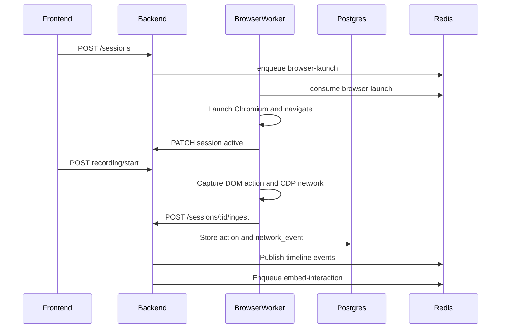

## Why

The browser-worker is the core V1 runtime that turns a human browser session into structured action, network, DOM, and intent records. The frontend and backend are already scaffolded around this flow, but `apps/browser-worker` is currently README-only. Without a runnable worker, recording controls cannot produce real timeline events, Postgres remains empty for captured interactions, and embedding jobs have no source data.

**Success metric:** With Postgres, Redis, and the backend running, creating a session for the included fixture page launches Chromium, starting recording captures one user action and its matching network request, and within two seconds the backend stores the correlated records, publishes timeline events on `timeline:{session_id}`, and enqueues an embedding job.

## What Changes

- **New:** `apps/browser-worker` TypeScript service with BullMQ consumers for browser launch and replay jobs.
- **New:** Playwright session runtime that launches Chromium, navigates to the session URL, tracks recording state, and shuts down sessions cleanly.
- **New:** CDP network listener that captures request and response metadata for `fetch` and `XHR` calls.
- **New:** Capture engine that extracts stable DOM target metadata, correlates actions to nearby network requests, infers a rule-based intent, and sends a validated ingest bundle to the backend.
- **New:** Backend ingest route for worker-submitted capture bundles; the backend persists records, publishes WebSocket timeline events through Redis, and enqueues embed jobs.
- **New:** Shared schemas and constants for browser launch jobs, capture ingest bundles, and timeline event envelopes.
- **New:** Standalone browser-worker Dockerfile and local fixture page for smoke testing.

## Data Flow

## Capabilities

### New Capabilities

- `browser-session-runtime`: Consumes browser-launch jobs, manages one Playwright page per session, and mirrors backend session state.
- `browser-playwright-capture`: Captures click and input DOM targets with label, selector, xpath, element, and value metadata.
- `browser-cdp-network`: Captures request/response pairs from Chrome DevTools Protocol.
- `browser-capture-engine`: Correlates a user action to a network event within the V1 time window and produces an intent hint.
- `backend-capture-ingest`: Accepts validated capture bundles from the worker and persists/publishes them.
- `browser-replay-consumer`: Acknowledges replay-session jobs and drives simple stored UI steps when enough data is present.

### Modified Capabilities

- `backend-session-api`: `POST /sessions` also enqueues a `browser-launch` job. `PATCH /sessions/:id` lets the worker update runtime status and current URL.

## Non-goals

- Full noVNC stack and frontend browser embedding.
- Embedding-worker implementation.
- LLM-powered workflow assembly.
- Docker Compose full-stack wiring.
- Multi-user authentication or service-to-service auth.
- Anti-bot handling, browser extensions, or visual AI.

## Impact

- `apps/browser-worker/` — primary implementation target.
- `apps/backend/` — ingest route, session runtime update route, browser launch producer, and query helpers.
- `packages/shared/` — schemas, constants, and types consumed by backend and browser-worker.
- `docker/standalone/browser-worker/` — runnable container image for the worker.
