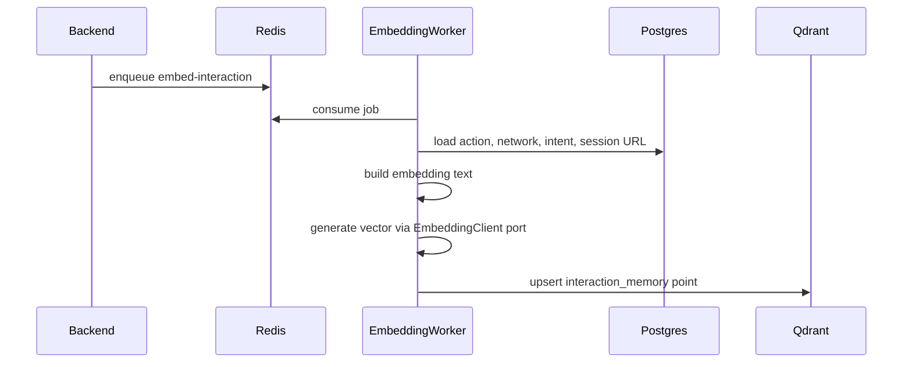

## Why

The backend and browser-worker now persist captured interactions and enqueue `embed-interaction` jobs after each ingest, but `apps/embedding-worker` is still README-only. Without a runnable worker, Qdrant stays empty, the action-to-API memory layer cannot support similarity search, and the async intelligence half of the V1 capture pipeline is incomplete.

**Success metric:** With Postgres, Redis, Qdrant, and the backend running, after one correlated capture ingest the embedding-worker consumes the `embed-interaction` job within 5 seconds, upserts one point into Qdrant collection `interaction_memory` with the required payload fields, and a repeat job for the same `action_id` is idempotent (no duplicate points).

## What Changes

- **New:** `apps/embedding-worker` TypeScript service with a BullMQ consumer for `embed-interaction` jobs.
- **New:** Postgres reader that hydrates action, network event, intent, and session context for each job.
- **New:** Deterministic interaction text builder that turns structured capture records into embedding input text.
- **New:** Swappable `EmbeddingClient` port with a V1 default implementation (provider choice deferred to design).
- **New:** Qdrant client that ensures the `interaction_memory` collection and upserts vectors with the required payload.
- **New:** Shared constants and Zod schema for the Qdrant interaction memory payload.
- **New:** Standalone embedding-worker Dockerfile and `.env.example`.

## Data Flow

## Capabilities

### New Capabilities

- `embedding-job-consumer`: Consumes `embed-interaction` BullMQ jobs, validates payloads, orchestrates fetch → embed → upsert, and logs job lifecycle with idempotent retries.
- `embedding-interaction-text`: Builds deterministic embedding text from action, network event, intent, and session context per the V1 template.
- `embedding-model-port`: Defines the `EmbeddingClient` interface and V1 implementation for generating vectors from text.
- `embedding-qdrant-store`: Ensures the `interaction_memory` collection exists and upserts vectors with the required payload fields.

### Modified Capabilities

_(none — `backend-capture-ingest` already enqueues embed jobs; no requirement changes needed)_

## Non-goals

- Backend similarity-search API (`GET /memory/search` or similar).
- Docker Compose full-stack wiring.
- LLM-powered intent extraction.
- Qdrant rebuild CLI or migration tooling.
- Frontend UI for memory search.
- Changes to browser-worker or backend capture ingest behavior.

## Impact

- `apps/embedding-worker/` — primary implementation target.
- `packages/shared/` — Qdrant collection constant and interaction memory payload schema/types.
- `docker/standalone/embedding-worker/` — runnable container image for the worker.
- `apps/backend/` and `apps/browser-worker/` — no functional changes; they already produce embed jobs and shared types.
